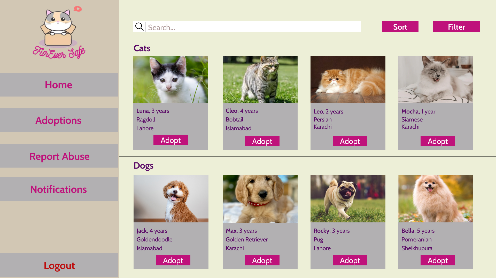

# CivicBridge

CivicBridge is a small static website created for a fictional technology startup as part of the **Professional Practices in IT** course at FAST-NUCES. The concept explores how a civic-tech company might present digital services for NGOs and community organizations.

> **Academic project:** CivicBridge is not an operating company, and the services shown on this website are conceptual. FurEverSafe appears as an illustrative example inspired by a separate, early-stage startup; this repository is not the FurEverSafe product or its official website.

## Preview



Open `index.html` to explore the four-page website: Home, Services, About, and Contact.

## Technology

- HTML5
- [Tailwind CSS](https://tailwindcss.com/) through its browser CDN
- Vanilla JavaScript for the contact-form prototype

This is a static prototype: it has no backend, database, build step, or functional message delivery.

## Run locally

Clone the repository and open `index.html` in a browser. Alternatively, serve the directory with any static file server; for example:

```bash
python -m http.server 8000
```

Then visit `http://localhost:8000`.

## Contributions

- **Meerab Munir:** implemented the website and its visual presentation via vibecoding.
- **Shehryar Hassan:** helped define team roles, prepared and delivered the course presentation, and performed a QA review for consistency with the fictional business plan.

The broader fictional team and course roles are shown on the About page. The Git history reflects Meerab's implementation work; this section records the non-code contributions that are not represented by commits.

## Status

Completed academic prototype. The repository is retained as a record of the course project and is not under active product development.
